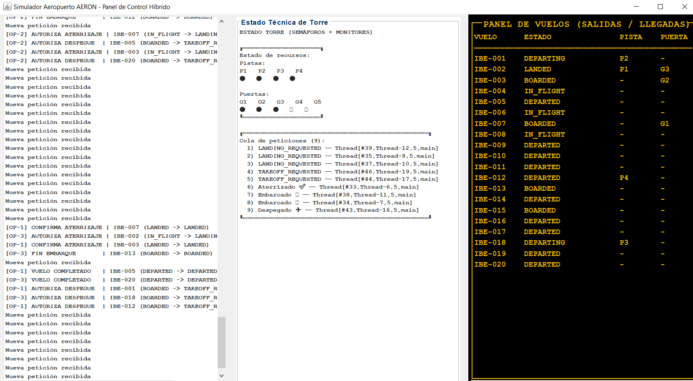
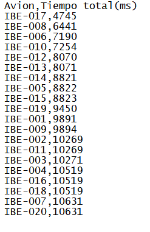
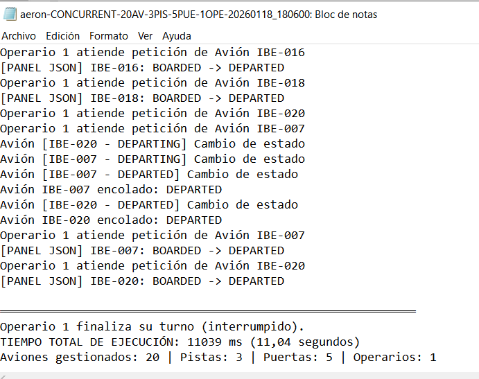
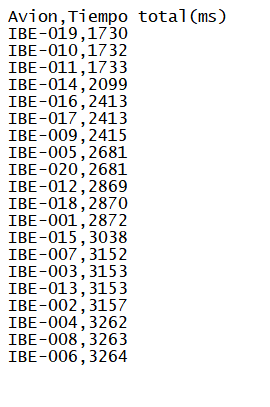
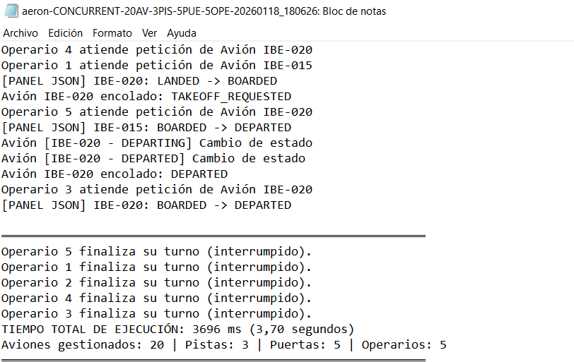
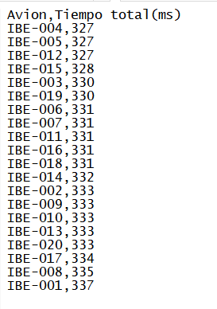
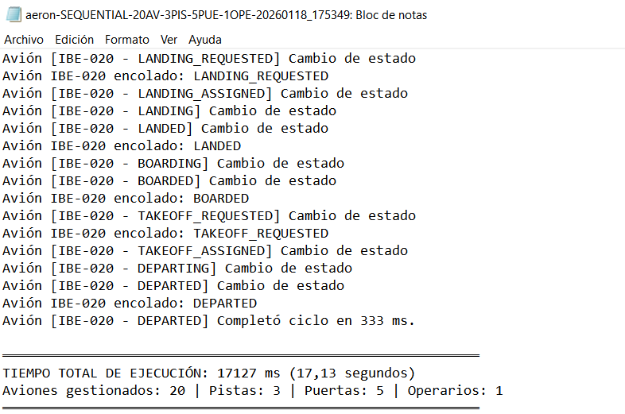

# ✈️ Proyecto AERON
**Autor: Javier Conejero Rodríguez.**
**Aeropuerto Extremeño de Regulación y Operaciones de Navegación.**
**PCD curso 25/26)**

El proyecto AERON consiste en el diseño e implementación de un simulador de gestión aeroportuaria basado en software, cuyo objetivo principal es la resolución de problemas complejos de sincronización y concurrencia. El sistema modela el flujo operativo de un aeropuerto donde múltiples entidades (aviones y operarios) compiten por recursos físicos limitados, como pistas de aterrizaje y puertas de embarque.

---

## 📋 Descripción del Sistema

Al ejecutar la clase aeronLaunchen, nos aparecerá un menú donde podremos elegir si queremos realizar una ejecución secuencial o concurrente.

- Si elegimos la ejecución *secuencial*, debemos rellenar posteriormente el número de aviones que vamos a simular, el número de puertas y el número de pistas que dispondrá el aeropuerto.

- Si elegimos la ejecución *concurrente*, podremos elegir el número de aviones a simular, el número de puertas de embarque, el número de pistas del aeropuerto y el número de operarios que operarán la torre de control simultaneamente.

El simulador mostrará una pestaña como la que se muestra a continuación con 3 ventanas:

Donde se pueden distinguir 3 paneles, tal y como se describe en el enunciado de la práctica.
- el Panel de vuelos con el estaod de los aviones en todo momento.
- El panel de la torre de control, proporcionado por el profesor mediante la clase airportState.
- El panel que irá informando de todas las acciones que realizan los operarios y las peticiones que irán llegando

 el ciclo de vida completo de los aviones, desde la solicitud de aterrizaje hasta el despegue final, garantizando la integridad de los datos y evitando interbloqueos (deadlocks). A continuación se detalla los estados: 

1. $IN\_FLIGHT$ (En Vuelo): Es el estado inicial de todo avión al comenzar la simulación.Acción: El avión se encuentra en el espacio aéreo esperando para iniciar su aproximación. El avión genera una petición de aterrizaje a la Torre de Control.

2. $LANDING\_REQUESTED$ (Aterrizaje Solicitado): El avión entra en la cola de peticiones de la torre. Recursos: La torre debe encontrar una Pista ($Runway$) y una Puerta ($Gate$) libres simultáneamente para darle "luz verde".

3. $LANDING$ (Aterrizando): Una vez que el operario confirma que hay recursos, el avión cambia a este estado. Se simula la maniobra de toma de tierra (habitualmente con un Thread.sleep(100)).Estado de Recursos: En este punto, el avión ocupa físicamente una pista y tiene reservada una puerta.

4. $LANDED$ (Aterrizado): El avión ha completado la maniobra de aterrizaje y se dirige a la puerta de embarque. Se envía una notificación a la torre informando que la pista ya no es necesaria. La torre libera la Pista, permitiendo que otros aviones aterricen o despeguen, pero el avión mantiene ocupada la Puerta.

5. $BOARDING$ (Embarcando)El avión está estacionado en la puerta de embarque. Se simula el proceso donde los pasajeros suben al avión (Thread.sleep(150)).NOTA: En mi caso he realizado una simulación del proceso de onboarding de los pasajeros, la clase pasajeros no la utilizo como tal. 

6. $BOARDED$ (Embarcado): El proceso de carga de pasajeros ha finalizado.Acción: El avión notifica que está listo para dejar la puerta. La torre libera la Puerta de Embarque. El avión ahora está esperando turno para salir.

7. $TAKEOFF\_REQUESTED$ (Despegue Solicitado): El avión solicita permiso para salir del aeropuerto. El avión espera a que un operario le asigne una pista de despegue (que puede ser distinta a la de aterrizaje).Recursos: Se requiere una Pista libre exclusivamente.

8. $DEPARTING$ (Despegando): El operario ha concedido la pista y el avión inicia la carrera de despegue. Se simula la maniobra de despegue (Thread.sleep(100)). Por tanto, ocupa la pista asignada.

9. $DEPARTED$ (Despegado): El avión ya está en el aire y fuera de las inmediaciones del aeropuerto. Se Notificaca a la torre y se libera la Pista final.

---
# DESARROLLO SECUENCIAL.

Para el desarrollo secuencial de la práctica, hemos implementado las siguietnes clases:

- **Airplane**: Esta clase se encarga de ejecutar la lógica del avión para ello irá simulando los estados mencionados anteriormente. Para simular el paso de un estado a otro se realizarán  *Requests*. Cada request se enviará a la torre de control para informar de que X avión quiere realziar la acción que corresponda. Las distintas fases que hemos definido se encuentran en el enum *Airplanestate*.

- **AirplaneState**: Posee un enum con todos los posibles estados del avión desde que está el avión en el aire y aterriza hasta que vuelve a despegar.

- **Gate**: Esta clase representa la puerta de embarque, basicamente es lo que se conoce en Java como POJO.

- **Runway**: Esta clase representa las pistas de aterrizaje/despegue y tambien es una clase POJO.

- **Passenger**: Clase POJO que representa los pasajeros pero que no posee ninguna función implementada ya que he considerado que no aporta gran información ni tampoco funcionalidad al propio desarrollo de la práctica.

- **Request**: Clase que se encarga de formar las peticiones de los aviones que se almacenarán en una cola de peticiones en *ControlTower*

- **ControlTower**: Clase principal que se encarga de la gestión del flujo del aeropuerto. Posee una lista con las puertas de embarque y con las pistas de aterrizaje ademas de una cola de peticiones FIFO, para los aviones. La función de esta clase es gestionar los estados de los aviones y asignar pistas y puertas de embarques a los aviones según las necesiten. Además posee la funcionalidad de interactuar con la interfaz mediante la clase Window.

- **Logger**: Esta clase se encarga de crear el fichero de logs y de crear los metodos necesarios para poder almacenar la información recogida durante la ejecución.

- **ReportManager**: Esta clase se encarga de generar el CSV con los tiempos de los aviones tal y como indica el enunciado.
**NOTA: La información del tiempo que tardan en ejecutar se inicia al comienzo de su ciclo. Es decir, cuando están en vuelo. Esto provoca que los últimos aviones en procesar su ciclo tardarán más ya que se quedan en el aire esperando a que haya recursos disponibles para aterrizar.

- **Window**: Clase encargada de gestionar la GUI del programa.

- **Main Secuencial**: Main que ejecuta la lógica del programa secuencial.

La ejecución de este programa hará que se gestionen los aviones uno por uno. Dando lugar a una ejecución larga e ineficiente ya que solo un par de recursos(pista, puerta de emabarque) serán gestionados a la vez.

# Desarrollo Concurrente.

Para el desarrollo concurrente hemos partido del desarrollo secuencial y hemos comenzado a ejecutar ciertos cambios y modificaciones. En primer lugar identificamos dos problemas de concurrencia.

- **La gestión de la cola de peticiones**: Esta ha sido solventada mediante el uso de un semáforo. Aquí tenemos un ejemplo del productor-consumidor, ya que tenemos que los operadores, en este caso vamos a tener varios, consumen las peticiones que producen los aviones. Por un lado, tenemos un semáforo que actúa como cerrojo para garantizar la exclusión mutua a la hora de insertar o extraer una petición de nuestra cola de peticiones. Y por otro lado, tenemos un semáforo que actúa como contador de peticiones pendientes de procesar. 

## El Flujo de Trabajo (Productor-Consumidor):

A. El Avión (Productor): Cuando un avión necesita cambiar de estado, ejecuta los siguientes pasos:

- queueMutex.acquire(): Solicita permiso para acceder a la cola.
- requestQueue.add(request): Inserta la petición en la cola.
- queueMutex.release(): Libera el acceso a la cola para otros hilos.
- requestsAvailable.release(): Incrementa el contador de peticiones. Si había un operario durmiendo porque la cola estaba vacía, este paso lo "despierta" inmediatamente.

 B. El Operario (Consumidor): Los operarios están en un bucle infinito realizando estas operaciones:
- requestsAvailable.acquire(): Intenta coger una petición. Si el contador es 0, el hilo se bloquea aquí hasta que un avión haga un release.
- queueMutex.acquire(): Una vez despertado, pide permiso para acceder a la lista de forma exclusiva.
- requestQueue.poll(): Extrae la petición de la cabecera.
- queueMutex.release(): Libera el cerrojo de la lista.

Además de esto es necesario implementar mecanismos de sincronización para la gestión de los recursos del aeropuerto disponibles, es decir la asignación de las pistas y las puertas. Para ello, se ha usado un *Monitores* para garantizar la exclusión mutua. 

1.  **Implementación mediante synchronized**:
Hemos utilizado la palabra reservada *synchronized* en el método processRequest de la Torre de Control. Esto convierte a toda la instancia de la torre en un monitor:

- Bloqueo de Objeto: Cuando un operario entra en processRequest, adquiere el lock de la torre. Ningún otro operario puede evaluar o modificar el estado de las pistas o puertas hasta que el primero haya terminado.

- Atomicidad: La búsqueda de una pista libre (findFreeRunway) y de una puerta libre (findFreeGate) se realiza a la vez. Si ambos recursos están disponibles, se marcan como ocupados antes de soltar el monitor.

El monitor gestiona los recursos de la siguiente manera:

- Evaluación: El hilo evaluador (Operario) entra en el monitor.
- Verificación Logística: Se comprueba la disponibilidad en las listas de Runways y Gates.
- Asignación o Rechazo: * Si los recursos están disponibles, se asignan al avión y el método devuelve true.
- Si están ocupados, el método devuelve false inmediatamente, permitiendo que el operario libere el monitor y el avión reintente su petición más tarde (evitando el bloqueo del hilo operario).

*NOTA*: No he usado wait y notify porque entonces el operario se quedaría bloqueado esperando a que las pistas y puertas se liberen mientras podría estar atendiendo a peticiones como despegues o embarques. Ademas cabe destacar que cuando los operarios no pueden asignar recursos a los aviones se ponen a dormir un breve intervalo para posteriormente volverlo a intentarlo.

## Novedades de implementación respectoa secuencial

- **Airplane**: Ahora será un hilo propio que se encargará de ir pasando por todos los estados de su ciclo de vida mediante la emisión de peticiones concurrentes para ir cambiando de estado.

- **Operator**: Esta clase corresponde a los hilos de los operadores de la torre. Que como ya hemos visto actúan como consumidores. Es una clase que implementa los mecanismo de sincronización y concurrencia ya mencionados.

- **ControlTower**: Esta clase actúa como gestor de las comunicaciones y monitor de recursos, como ya hemos mencionado. Además de lo ya comentado implementa Implementa el método printStatus con tryAcquire(), lo que permite a la interfaz gráfica leer el estado del sistema sin bloquear la lógica de los hilos de simulación.

- **Logger**: Esta clase implementa metodos de escritura protegidos usando syncronized.

- **FlightPanelJson**: Esta clase se encarga de cargar en un fichero JSON los estados de los aviones en cada momento de manera segura. A continuación se detalla los mecanismos de sincronización empleados

**A. Patrón Singleton Sincronizado**
El acceso a la clase se hace mediante getInstance(). Al usar la palabra clave synchronized en este método, garantizas que, aunque 5 operarios intenten crear el panel a la vez al arrancar el programa, solo se cree una instancia única.

**B. Colecciones Concurrentes (ConcurrentHashMap)**
Para almacenar los estados en memoria antes de escribirlos, se usa un ConcurrentHashMap. Esta colección permite que múltiples hilos lean y escriban simultáneamente en diferentes "segmentos" del mapa sin bloquearse entre ellos, lo que mantiene el rendimiento muy alto.

**C. Exclusión Mutua con ReentrantReadWriteLock**
Este es el mecanismo más importante para la integridad del archivo. Si dos hilos intentan escribir en el mismo archivo a la vez, el resultado sería un JSON mal formado (caracteres mezclados).
- Write Lock (fileLock.writeLock().lock()): Antes de empezar a escribir el archivo, el hilo adquiere este cerrojo.
- Bloqueo absoluto: Mientras un hilo está escribiendo, nadie más (ningún otro operario) puede empezar a escribir. Los demás se quedan esperando en fila hasta que el primero termine y libere el bloqueo en el bloque finally.

NOTA: A la hora de mostrar la información en el panel no he usado la información del JSON como tal ya que se decía en el enunciado que se pretendía hacer instantaneo el reporte de la información y he considerado que era más adecuado tal y como lo tenía implementado. Si tuvieramos que leer del JSON los estados de los aviones agregaríamos tareas de E/S al sistema que en lugar de agilizarlo lo relentizaría, dado que el acceso a memoría para extraer los datos es mucho más rapido y eficiente en este caso. Aún así la escritura de estos datos inmediatemente al JSON están implementados.

- **Main Concurrente**: Main que ejecuta la lógica del programa concurrente y ademas espera a que todos los hilos aviones que se instancian terminen su ejecución.

Además de los ya mencionado he introducido varias excepciones: 
- CSVWriteException.
- FlightPanelException.
- LogWriteException. 

Todas ellas son manejadas y lanzadas por el sistema cuando ocurre alguno de los errores que gestionan.

# Resultados de las ejecuciones

"Para ejecutar el programa se debe ejecutar AeronLauncher desde eclipse"

Se pide en el enunciado ejecutar las siguientes combinaciones: 
- Modo secuencial, con 2 aviones, 1 pista, 1 puerta 
- Modo secuencial, con 20 aviones, 3 pistas, 5 puertas 
- Modo concurrente, con 2 aviones, 1 pista, 1 puerta, 1 Operario 
- Modo concurrente, con 2 aviones, 1 pista, 1 puerta, 5 Operarios 
- Modo concurrente, con 20 aviones, 3 pista, 5 puertas, 1 Operario 
- Modo concurrente, con 20 aviones, 3 pistas, 5 puertas, 5 Operarios

Los resultados de las ejecuciones están recogidos en la carpeta log y dentro de ella se encuentran dos subcarpetas una de ellas para las ejecuciones concurrentes y otra para las ejecuciones secuenciales. 

EN este caso vamos a evaluar los resultados obtenidos para la ejecución concurrente.

 ## Modo concurrente 20 aviones, 1 operario.

Tras la ejecución podemos examinar la información obtenida en el csv y ademas examinar los logs.

A continuación se muestra el CSV: 

A continuación se muestra un fragmento del log:

En esta configuración, el sistema se comporta de forma casi secuencial en la toma de decisiones. Al existir un único hilo consumidor para la cola de peticiones, se observa lo siguiente:
- Tiempo de respuesta inicial: El primer avión en completar su ciclo (IBE-017) necesitó $4.745$ ms. Esto indica una saturación temprana de la cola.
- Tiempo de finalización total: La simulación completa terminó cuando el último avión (IBE-020) registró su salida a los $10.631$ ms.

- Comportamiento del sistema: Se genera un cuello de botella en la torre. Aunque haya pistas y puertas libres, el operario solo puede procesar una solicitud a la vez, obligando a los aviones a permanecer en espera pasiva durante periodos prolongados.
 ## Modo concurrente 20 aviones, 5 operarios.

Tras la ejecución podemos examinar la información obtenida en el csv y ademas examinar los logs.

A continuación se muestra el CSV: 

A continuación se muestra un fragmento del log:

Al incrementar el número de operarios, se introduce paralelismo real en la gestión de la torre, obteniendo resultados significativamente mejores:
- Tiempo de respuesta inicial: El primer avión (IBE-012) completó su ciclo en solo $1.228$ ms, una reducción drástica respecto al escenario anterior.
- Tiempo de finalización total: Todos los aviones finalizaron sus operaciones a los $3.264$ ms.Comportamiento del sistema: La torre es capaz de atender múltiples peticiones de aterrizaje, despegue y embarque de forma simultánea. La cola de peticiones se vacía con mayor rapidez, permitiendo que los aviones pasen más tiempo operando y menos tiempo esperando respuesta.

## Modo secuencial 20 aviones, 1 operario.

A continuación se muestra el CSV, en este caso se cuenta el tiempo desde que un avión comienza el aterrizaje hasta que vuelve a despegar no se cuenta el timepo que permanece en el aire: 

A continuación se muestra un fragmento del log:

Tarda un total de 17 segundos en terminar la ejecución.

## Conclusiones

- Escenario Secuencial: $17,00$ segundos.
- Concurrente (1 Op): $10,63$ segundos (Speedup: $1,60$).
- Concurrente (5 Ops): $3,32$ segundos (Speedup: $5,11$).

- Conclusión técnica: Los datos confirman que el diseño multihilo ha eliminado la ineficiencia del modelo secuencial. La transición a un modelo con $5$ operarios permite alcanzar un Speedup superior a $5$.